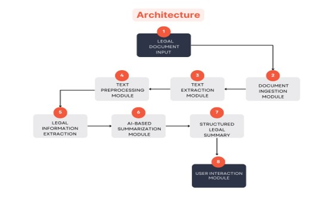
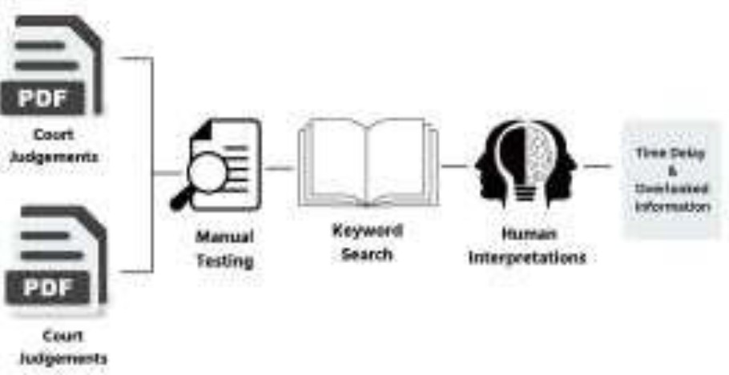
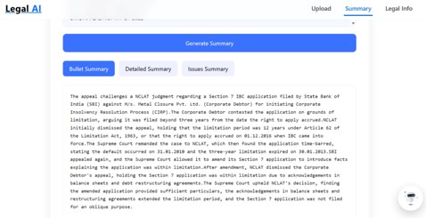
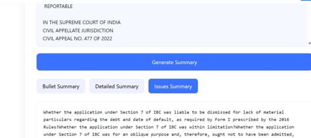
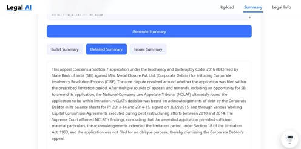

# ⚖️ Legal AI Case Report Summarizer

## 🚀 Overview

Legal AI Case Report Summarizer is an AI-powered legal document analysis system designed to extract important legal information and generate concise case summaries. The application helps law students, researchers, and legal professionals quickly understand lengthy legal documents through Natural Language Processing (NLP) techniques.

---

## ✨ Features

* 📄 Legal document analysis
* 📝 Automated case report summarization
* 🧠 NLP-based text processing
* 🔍 Key information extraction
* ⚖️ Legal content understanding
* 💻 User-friendly web interface
* 📊 Fast and efficient summary generation

---

## 🛠️ Tech Stack

### 🎨 Frontend

* ⚛️ React.js
* 📜 JavaScript
* 🎨 CSS
* 🌐 HTML

### ⚙️ Backend

* 🐍 Python
* 🌐 Flask

### 🤖 AI & NLP

* 🧠 Natural Language Processing (NLP)
* 🤖 Machine Learning Techniques
* 📚 Text Processing Libraries

---

## 📂 Project Structure

```text
Legal_AI/
│
├── frontend/
├── backend/
├── screenshots/
├── README.md
└── .gitignore
```

---

## ▶️ Running the Project

### Frontend

```bash
cd frontend
npm install
npm run dev
```

### Backend

```bash
cd backend
venv\Scripts\activate
python app.py
```

---

## 🔄 Workflow

1. 📤 Upload Legal Document
2. 📄 Extract Text Content
3. 🧹 Text Preprocessing
4. 🧠 NLP-Based Analysis
5. 📝 Generate Case Summary
6. 📊 Display Results

---

## 🏗️ Architecture Diagram



---

## 🔄 System Workflow



---

## 📸 Project Results

### Home Page / Upload Interface



### Generated Summary Output



### Case Analysis Results



---

## 👩‍💻 My Contribution

* ✅ Project Development
* ✅ Frontend Integration
* ✅ Backend Integration
* ✅ Legal Information Extraction
* ✅ Case Report Summarization
* ✅ Testing and Debugging
* ✅ UI Improvements

---

## 🎯 Skills Demonstrated

* Natural Language Processing (NLP)
* React.js Development
* Flask Backend Development
* API Integration
* Legal Document Analysis
* AI-Powered Summarization
* Git & GitHub Version Control

---

## ⚠️ Known Limitations

* External API responses depend on internet connectivity.
* Slow network bandwidth may temporarily affect API communication.
* Large legal documents may require additional processing time.
* Summary quality depends on the quality of input documents.

---

## 🔮 Future Scope

* 🌍 Multilingual legal document support
* ⚖️ Legal citation extraction
* 🤖 Advanced AI-powered summarization
* 💬 Legal AI Assistant Integration
* 📱 Mobile Application Support

---

## 🎓 Academic Project

**B.Tech Final Year Project**

**Project Title:**
**LEGAL INFORMATION EXTRACTION AND CASE REPORT SUMMARIZATION GENERATION**

Department of Information Technology

---

## 📧 Author

**Jyothika K**

GitHub: https://github.com/jyotika06

---

⭐ If you found this project useful, consider giving it a star on GitHub.
